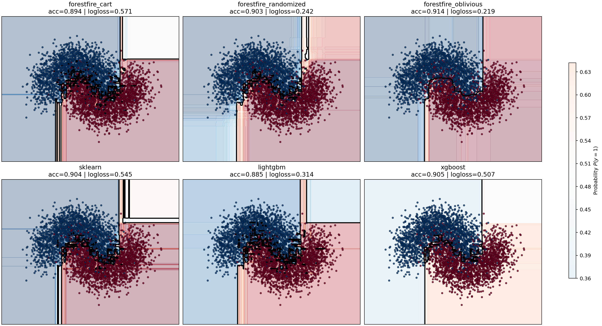
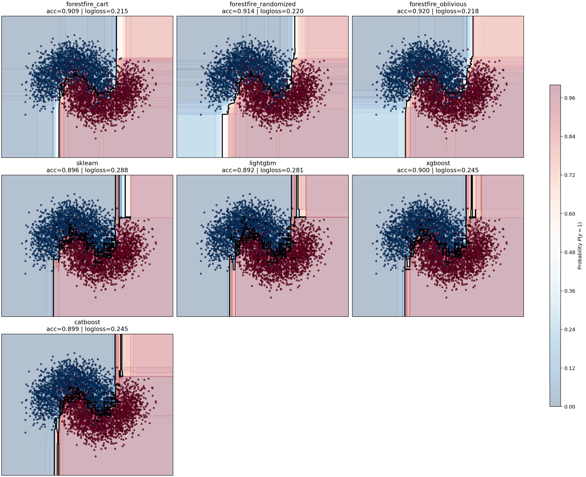

# Benchmarks

The benchmark suite is now focused on the two ensemble families that matter most for ForestFire’s current positioning:

- random forest
- gradient boosting

It intentionally no longer centers extra-trees-specific comparisons or the older one-off inference plots.

All active benchmark families use `1000` trees or boosting stages by default.
That tree-count budget is held equal across libraries, while the per-cell leaf
budget is still matched from the realized ForestFire model.

## What is benchmarked

The suite currently measures:

- training time
- prediction time
- training micro-phases
- prediction micro-phases
- `make_moons` probability surfaces for classifier ensembles

For prediction, the suite also includes:

- base ForestFire models
- all-core `optimize_inference()` ForestFire models

That means the prediction grid is designed to show both:

- how the semantic model behaves directly
- how much the optimized runtime changes the picture once row counts get large

## Libraries compared

Depending on the family, the benchmark scripts compare against:

- ForestFire
- ForestFire optimized inference
- scikit-learn
- LightGBM
- XGBoost
- CatBoost

Important qualifications:

- CatBoost is included for gradient boosting
- CatBoost does not expose a direct random-forest benchmark mode, so the RF grid records it as unsupported there rather than pretending there is a like-for-like RF comparison
- the prediction benchmark still uses the same backend set
- but each backend is trained once per feature-count cell, after which only prediction is timed across the row grid

## Dataset design

The benchmark datasets are intentionally learnable.

They are not random-label or pure-noise benchmarks.

Each dataset includes:

- threshold structure
- interactions
- linear signal
- nonlinear signal
- extra noisy features

That matters because the point of these benchmarks is not just to stress parsers or tree allocators. It is to measure the cost of training and serving models that have real structure to discover.

## Benchmark grid

The benchmark scripts run over:

- rows: `2^13`, `2^15`, `2^17`, `2^19`
- columns: `8`, `16`, `32`, `64`, `128`, `256`

These are logarithmic grids:

- rows on powers of 2 with exponent steps of 2
- columns on powers of 2

The purpose of the grid is to separate two different scaling questions:

- what happens as dataset length grows?
- what happens as search width grows?

Those are not the same pressure on a tree system.

## Micro-benchmarks

The grid benchmarks answer end-to-end questions.

The micro-benchmarks answer a different question:

- where is ForestFire itself spending the time?

They are ForestFire-only by design. They do not compare against other
libraries, because the point is to isolate ForestFire’s own bottlenecks rather
than library-to-library competitiveness.

### Training micro-benchmark

The training micro-benchmark splits the fit path into three phases:

- `table_build`
- `fit_from_table`
- `fit_end_to_end`

What those mean:

- `table_build`: training-side preprocessing only
- `fit_from_table`: learner fit on an already-built `Table`
- `fit_end_to_end`: the full public `train(X, y, ...)` path

This lets you see how much of total training time is being spent in:

- input normalization
- binning / sparse-vs-dense table construction
- the learner itself

The training micro-benchmark still runs over a row/feature grid, but it uses a
smaller default row range than the macro benchmark so fixed preprocessing
overheads remain visible.

### Prediction micro-benchmark

The prediction micro-benchmark fixes training complexity and varies only
prediction batch size.

That separation is important, because otherwise a prediction benchmark is partly
a training benchmark in disguise: changing the row count also changes the
realized model.

The prediction micro-benchmark therefore:

1. trains one reference model at a fixed training row budget
2. lowers it to an optimized runtime once
3. serializes / reloads the compiled optimized artifact once
4. benchmarks only the runtime prediction paths on varying batch sizes

The prediction phases are:

- `predict_base`
- `predict_optimized`
- `predict_compiled`

What those mean:

- `predict_base`: semantic `Model.predict(...)`
- `predict_optimized`: lowered `OptimizedModel.predict(...)`
- `predict_compiled`: deserialized compiled-artifact runtime

That makes it easier to answer questions like:

- is the optimized runtime faster once training complexity is held constant?
- how much of the benefit survives compiled-artifact reload?
- at what batch size does the optimized runtime start pulling away?

## `make_moons` probability benchmark

The grid and micro-benchmarks answer runtime questions.

They do not show *what kind of classifier boundary each model actually learns*.

For that, the suite now includes a dedicated `sklearn.datasets.make_moons`
benchmark that focuses on a two-dimensional nonlinear classification problem
where a probability surface is visually informative.

The benchmark trains two ForestFire variants for each family:

- ForestFire CART
- ForestFire oblivious

and compares them against the closest ensemble implementations in the other
libraries:

- scikit-learn
- LightGBM
- XGBoost
- CatBoost for gradient boosting

The purpose is different from the grid benchmarks:

- show how confidently each model partitions the two-moons manifold
- show whether the probability field is smooth, blocky, symmetric, or brittle
- make the CART-vs-oblivious tradeoff visible for ForestFire directly

The benchmark writes:

- per-family probability-surface figures
- per-family JSON results with train time, predict time, accuracy, and log loss
- per-family markdown summaries

Current plot outputs:

- [Random Forest make_moons probabilities](benchmarks/moons_probabilities_random_forest.png)
- [Gradient Boosting make_moons probabilities](benchmarks/moons_probabilities_gradient_boosting.png)

## Complexity matching

To keep the cross-library comparisons more meaningful, each grid cell now uses ForestFire as the complexity reference.

The benchmark flow is:

1. train the ForestFire model for that grid cell
2. inspect every constituent tree
3. take the largest realized leaf count
4. use that leaf budget when configuring the comparable backends

That means the benchmark is no longer comparing models that merely share:

- the same nominal `n_estimators`
- the same nominal `max_depth`

It also tries to align the *realized* per-tree complexity.

Just as important, the benchmark avoids adding a second independent tree-size cap on top of that leaf budget.

So the suite does **not** intentionally constrain tree size through:

- `max_depth`
- `min_samples_split`
- `min_samples_leaf`

except where a backend does not expose a true unlimited mode. In those cases the benchmark uses a large non-binding depth sentinel so the leaf budget remains the practical complexity control.

Why this matters:

- different libraries can interpret depth and split heuristics differently
- the same `max_depth=8` does not guarantee the same realized tree size
- without a leaf-budget alignment, some libraries may simply be training much larger trees than others

The exact mapping depends on backend capabilities:

- sklearn: `max_leaf_nodes`
- LightGBM: `num_leaves`
- XGBoost: `grow_policy="lossguide"` with `max_leaves`
- CatBoost: `grow_policy="Lossguide"` with `max_leaves`

ForestFire itself is still timed independently after the reference fit for training benchmarks. The reference fit exists only to establish the complexity target for that grid cell.

That complexity-matching flow applies to training only.

Prediction is now decoupled from fitting in a simpler way:

- one fixed training dataset is chosen per feature-count cell
- each backend is trained once on that fixed dataset
- only inference calls are timed across the prediction row grid
- training cost is no longer paid inside the prediction timing loop

## Tasks

- `task benchmark-training-rf`
- `task benchmark-training-gbm`
- `task benchmark-prediction-rf`
- `task benchmark-prediction-gbm`
- `task benchmark-training-micro-rf`
- `task benchmark-training-micro-gbm`
- `task benchmark-prediction-micro-rf`
- `task benchmark-prediction-micro-gbm`
- `task benchmark-moons`
- `task benchmark-regression-surface`
- `task benchmark-micro`
- `task benchmark`

The task split is:

- `task benchmark`: cross-library end-to-end train/predict grids
- `task benchmark-micro`: ForestFire-only phase breakdowns
- `task benchmark-moons`: two-dimensional probability-surface comparison on `make_moons`
- `task benchmark-regression-surface`: one-dimensional prediction-curve comparison on a synthetic regression task

## Output artifacts

Benchmark artifacts are written under `docs/benchmarks/`.

For each family/problem pair, the scripts write:

- `training_grid_results_<family>_<problem>.json`
- `prediction_grid_results_<family>_<problem>.json`
- `training_micro_results_<family>_<problem>.json`
- `prediction_micro_results_<family>_<problem>.json`
- `training_grid_<family>_<problem>.png`
- `prediction_grid_<family>_<problem>.png`
- `training_micro_<family>_<problem>.png`
- `prediction_micro_<family>_<problem>.png`
- `training_summary_<family>_<problem>.md`
- `prediction_summary_<family>_<problem>.md`
- `training_micro_summary_<family>_<problem>.md`
- `prediction_micro_summary_<family>_<problem>.md`
- `moons_results_<family>.json`
- `moons_probabilities_<family>.png`
- `moons_summary_<family>.md`

The summary markdown files are generated from the measured results and call out:

- which backend is fastest in the most grid cells
- median measured time by backend
- scaling from the smallest to the largest row count
- optimized-vs-base ForestFire speedups where applicable

For the micro-benchmarks, the generated summaries instead focus on:

- median time per ForestFire phase
- preprocessing share of end-to-end training
- optimized / compiled speedups over semantic prediction
- scaling from the smallest to the largest batch size

Artifacts are updated incrementally as the grid runs, so long benchmark executions still leave behind partial plots, JSON, and summaries instead of producing only all-or-nothing output.

## How to read the plots

Each plot is a grid of feature-count subplots.

Inside each subplot:

- x-axis: row count
- y-axis: time
- one line per backend

Both axes are logarithmic.

That is deliberate:

- tree learners and runtimes often scale multiplicatively rather than additively
- log axes make slope comparisons more informative

## What to pay attention to in the results

When you look at the generated plots and summaries, the important patterns are usually:

### Random forest training

Watch how quickly time rises as both:

- rows increase
- feature count increases

RF training cost is especially sensitive to repeated split search, so this is the place where:

- histogram efficiency
- feature subsampling
- per-tree overhead

show up most clearly.

Because the suite now aligns the other libraries to ForestFire’s realized leaf budget, large remaining gaps are less likely to be explained by one backend simply building much bigger trees.

### Gradient boosting training

Watch whether the backend spends more time per stage as the row count grows.

Boosting behaves differently from RF because it is:

- sequential across stages
- re-evaluating residual structure repeatedly
- more exposed to stage-wise stopping logic

For ForestFire specifically, GBM results are also shaped by:

- canary-based stage stopping
- second-order tree fitting
- gradient-focused row sampling

So if ForestFire’s GBM trains fewer effective stages than another backend on the same grid cell, that is often an intended consequence of the stopping strategy rather than just a raw implementation speed effect.

The leaf-budget matching helps here too, but it does not eliminate all policy differences. ForestFire’s canary-based stage stopping is still a genuinely different training rule from the early-growth behavior of the other libraries.

### Prediction

Prediction is now a predict-only benchmark over a fixed set of already-fitted models.

As row counts grow, the interesting questions are:

- how early does optimized inference separate from the base model?
- does that gap widen as the row count grows?
- does the gap widen more for RF than for GBM?
- how do the non-ForestFire backends compare when their training cost is not part of the measurement?

That is a much cleaner direct measure of runtime prediction behavior, because the benchmark no longer hides inference behind per-cell training cost.

## Interpreting backend differences

A few differences are structural, not accidental:

- LightGBM and XGBoost are heavily optimized around histogram-based boosting and large-scale batch workloads
- scikit-learn is usually a strong baseline for conventional RF behavior, but it is not built around the same runtime-lowering story
- CatBoost is most meaningful as a GBM comparison, not an RF comparison
- ForestFire’s RF and GBM behavior includes design choices other libraries do not share, especially:
canaries for tree-growth and GBM-stage stopping, explicit optimized runtime lowering, and unified binning semantics shared across training, serialization, and inference

That warning matters most for training.

For prediction, the main interpretation question is now:

- how much faster is each backend at pure inference once model fitting has been paid for already?

## Documentation and generated summaries

This page explains what the benchmark suite is designed to show.

The result-specific commentary should come from the generated summary files after you run the benchmarks locally, because those summaries reflect the actual measured grid rather than a hand-written expectation.

Once the benchmarks are run, the most useful files to inspect alongside the plots are:

- `training_summary_random_forest_classification.md`
- `training_summary_random_forest_regression.md`
- `training_summary_gradient_boosting_classification.md`
- `training_summary_gradient_boosting_regression.md`
- `prediction_summary_random_forest_classification.md`
- `prediction_summary_random_forest_regression.md`
- `prediction_summary_gradient_boosting_classification.md`
- `prediction_summary_gradient_boosting_regression.md`
